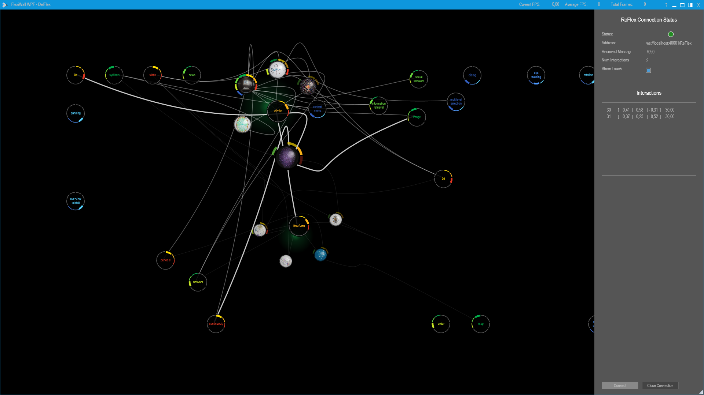

# DeeP_LegacyWPF (ReFlex)

Conversion of the legacy WPF application for xCoAx 2015 Paper "Data Exploration on Elastic Projections" to use ReFlex framework

* Version: 2.3.0.0
* ReFlex-Version: 0.9.8 oder neuer
* Websocket-Address (default, can be configured in `appsettings`): `ws://127.0.0.1:40001/ReFlex`



## Prerequisites

.NET 10.0 SDK [Download](https://dotnet.microsoft.com/en-us/download/dotnet/10.0)

## Change WebSocket Address

edit `App.config` (in project) or `DeeP.dll.config` (in compiled project) and edit the lines: 

``` xml

    <setting name="ReFlexServerAddress" serializeAs="String">
      <value>localhost</value>
    </setting>
    <setting name="ReFlexServerPort" serializeAs="String">
      <value>40001</value>
    </setting>
    <setting name="ReFlexServerEndpoint" serializeAs="String">
      <value>ReFlex</value>
    </setting>
```

## ReFlex usage

* the source files from [ReFlex Framework](https://github.com/visualengineers/reflex) are copied into `library/src/Core/Common` and `library/src/Core/Networking` (from [Version 0.9.8](https://github.com/visualengineers/reflex/releases/tag/v0.9.8))
